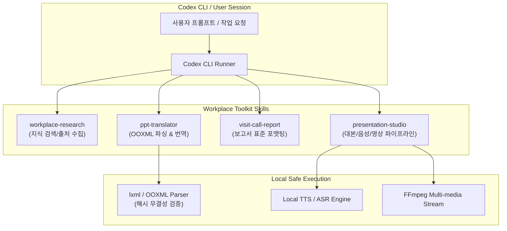

# Workplace Toolkit 🛠️

[](https://python.org)
[](https://github.com/dontotl/workplace-toolkit)
[](LICENSE)
[](docs/architecture.md)

**Workplace Toolkit**은 OpenAI Codex CLI 환경에서 팀과 개인이 공유·재사용할 수 있는 엔터프라이즈급 업무 자동화 스킬(Skills) 패키지입니다. 

> **🛡️ Privacy & Security First**  
> 개인 경로, 사내 API 키, 사내 문서 원본을 하드코딩하거나 외부로 유출하지 않고, 사용자 로컬 환경과 승인된 도구 세션 내에서만 동작하도록 설계되었습니다.

---

## 📦 포함된 핵심 스킬 (4종)

| 스킬명 | 주요 역할 | 동작 파이프라인 & 요구 환경 |
|---|---|---|
| **`workplace-research`** | 웹 · Slack · Outlook · SharePoint · OneDrive 정보 조사 및 근거 정리 | 브라우저/검색 도구 및 승인된 데이터 커넥터 세션 |
| **`ppt-translator`** | 원본 포맷/레이아웃을 100% 보존하는 PPTX 자동 번역 및 OOXML 검증 | Python 3.11+, `lxml`; 렌더링 검수용 Office/LibreOffice |
| **`visit-call-report`** | 고객 미팅 메모 및 히스토리 로그 기반 한국어 표준 보고서 작성 | 미팅 메모, 선택형 JSON/CSV 이력 데이터 |
| **`presentation-studio`** | 대본 생성, 로컬 음성 합성(TTS), 자막(SRT), 영상(MP4) 자동 제작 | 로컬 TTS/ASR 런타임 모델, FFmpeg |

---

## 🏗️ 아키텍처 및 처리 경계 (Architecture)

각 스킬은 독립적인 `SKILL.md`, 지침 매뉴얼, 로컬 실행 스크립트, 단위 테스트를 포함하여 개별적으로 설치하거나 패키지 전체로 배포할 수 있습니다.



### 1. PPT 번역 무결성 파이프라인
```text
원본 PPTX → manifest.json (텍스트 해시화) → Codex 인메모리 번역 → 새 PPTX 반영 → XML/화면 구조 검수
```
- 모든 텍스트 노드 ID와 해시를 추적하여 누락·변형을 원천 차단합니다.
- 부호, 통화, 숫자 순서, 단위, URL, 사내 보호 용어를 규칙 기반으로 자동 검수합니다.

### 2. 발표 영상/음성 제작 파이프라인
```text
PPTX 슬라이드/노트 → 승인된 대본 → 로컬 FLAC 음성 생성 → 로컬 ASR 음성 인식 검수 → MP4 + SRT 자막 합성
```
- 영상 길이는 실제 발화 시간에 정밀하게 맞춰지며 강제 배속 왜곡이 없습니다.

---

## 🚀 설치 및 적용 방법 (Installation)

### 1. 저장소 복제
```bash
git clone https://github.com/dontotl/workplace-toolkit.git
cd workplace-toolkit
```

### 2. Codex 스킬 디렉토리에 설치
제공되는 배포 스크립트(`scripts/distribution.py`)를 통해 안전하게 설치합니다. 기존 스킬을 덮어쓰지 않는 안전장치가 내장되어 있습니다.

```bash
# 1) 시뮬레이션 (Dry-Run)
python3 scripts/distribution.py install --dest "$HOME/.agents/skills" --dry-run

# 2) 실제 설치
python3 scripts/distribution.py install --dest "$HOME/.agents/skills"
```

* 특정 스킬만 설치할 경우:
  ```bash
  python3 scripts/distribution.py install --dest "$HOME/.agents/skills" --skill ppt-translator
  ```
* 현재 프로젝트에만 로컬로 설치할 경우:
  ```bash
  python3 scripts/distribution.py install --dest .agents/skills
  ```

---

## 💡 실무 프롬프트 예시 (Usage)

Codex CLI 실행 후 다음과 같이 호출합니다:

```text
$workplace-research 최근 3개월 분기 성과 지표를 공식 사내 문서와 슬랙 채널에서 요약해줘. 외부 파일 다운로드는 제외할 것.
```

```text
$ppt-translator architecture_spec.pptx 파일을 한국어로 번역해줘. 슬라이드 레이아웃과 도형 서식은 그대로 유지해줘.
```

```text
$visit-call-report 오늘 진행한 고객사 테크 미팅 메모를 기반으로 표준 출장/방문 보고서 마크다운을 작성해줘.
```

```text
$presentation-studio 슬라이드 발표자 노트를 기반으로 자연스러운 한국어 설명 대본과 로컬 음성 나레이션 영상을 생성해줘.
```

---

## 📂 저장소 구조

```text
workplace-toolkit/
├── .codex-plugin/             # Codex 플러그인 매니페스트
├── docs/                      # 아키텍처 및 보안 가이드
│   ├── architecture.md        # 처리 경계 및 파이프라인
│   ├── installation.md        # 상세 설치 가이드
│   ├── security.md            # 보안 지침
│   └── verification.md        # 검증 및 테스트 가이드
├── scripts/
│   └── distribution.py        # 원자적 스킬 설치/관리 CLI
├── skills/
│   ├── workplace-research/    # 검색/조사 스킬
│   ├── ppt-translator/        # PPT 번역 및 XML 검증 스킬
│   ├── visit-call-report/     # 회의/방문 보고서 스킬
│   └── presentation-studio/   # 발표 영상 제작 스킬
└── tests/
    └── test_distribution.py   # 설치기 단위 테스트
```

---

## 🧪 테스트 및 검증 (Tests)

```bash
pip install -r requirements-dev.txt
pytest tests/
```

---

## 📄 라이선스 (License)

본 프로젝트는 [MIT License](LICENSE)에 따라 자유롭게 사용 및 수정할 수 있습니다.
